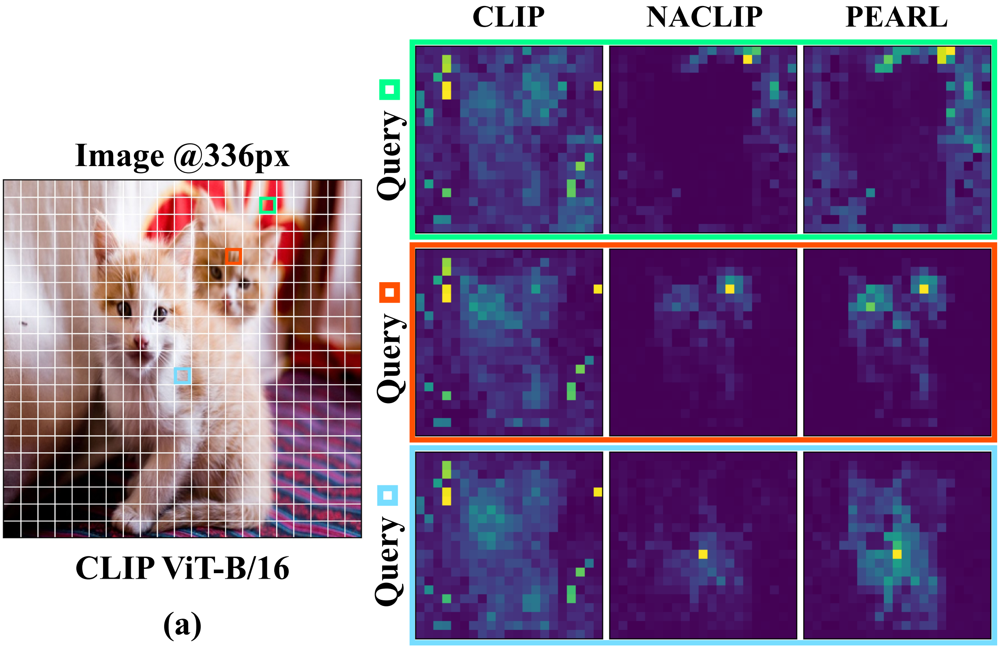
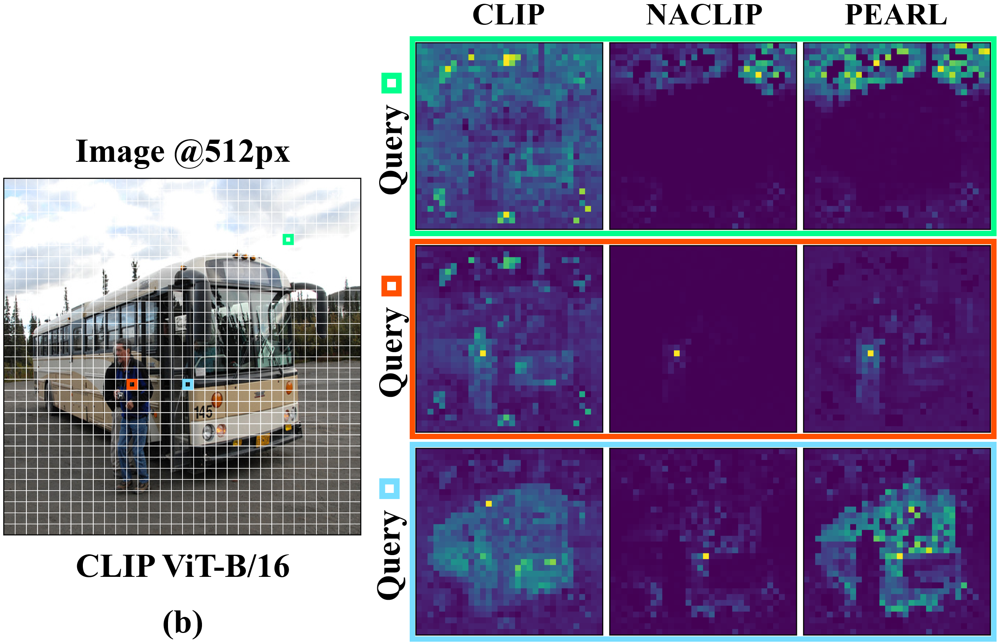
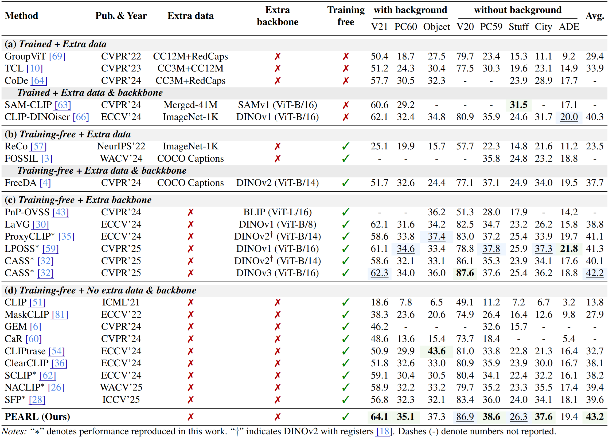

#  PEARL: Geometry Aligns Semantics for Training-Free Open-Vocabulary Semantic Segmentation

<div align="center">
    
    
</div>

> **Note:** We have retained the original title of our submission. Since modifying the title requires explicit approval from the Program Chairs (PC), the title remains unchanged to ensure consistency with our official submission.

## Abstract
Training-free open-vocabulary semantic segmentation (OVSS) promises rapid adaptation to new label sets without retraining. Yet, many methods rely on heavy post-processing or handle text and vision in isolation, leaving cross-modal geometry underutilized. Others introduce auxiliary vision backbones or multi-model pipelines, which increase complexity and latency while compromising design simplicity. We present PEARL, **P**rocrust**e**s **a**lignment with text-awa**r**e **L**aplacian propagation, a compact two-step inference that follows an align-then-propagate principle. The Procrustes alignment step performs an orthogonal projection inside the last self-attention block, rotating keys toward the query subspace via a stable polar iteration. The text-aware Laplacian propagation then refines per-pixel logits on a small grid through a confidence-weighted, text-guided graph solve: text provides both a data-trust signal and neighbor gating, while image gradients preserve boundaries. In this work, our method is fully training-free, plug-and-play, and uses only fixed constants, adding minimal latency with a small per-head projection and a few conjugate-gradient steps. Our approach, PEARL, sets a new state-of-the-art in training-free OVSS without extra data or auxiliary backbones across standard benchmarks, achieving superior performance under both with-background and without-background protocols.

## 1. Installation

This project is built upon **PyTorch 2.4.1** and **MMSegmentation**. Please follow the steps below to set up the environment.

### 1.1 Create Virtual Environment
We recommend using Anaconda to create a new virtual environment:

```bash
conda create -n pearl python=3.10 -y
conda activate pearl
````

### 1.2 Install Dependencies

Please install the dependencies with the specified versions to ensure proper functionality:

**Install PyTorch (CUDA 11.8):**

```bash
pip install torch==2.4.1+cu118 torchvision==0.19.1+cu118 --index-url [https://download.pytorch.org/whl/cu118](https://download.pytorch.org/whl/cu118)
```

**Install OpenMMLab Libraries:**

```bash
# Install MMEngine
pip install mmengine==0.10.7

# Install MMCV (Pre-built for PyTorch 2.4.0 and CUDA 11.8)
pip install mmcv==2.2.0 -f [https://download.openmmlab.com/mmcv/dist/cu118/torch2.4.0/index.html](https://download.openmmlab.com/mmcv/dist/cu118/torch2.4.0/index.html)

# Install MMSegmentation
pip install mmsegmentation==1.2.2
```

## 2. Data Preparation

Please download and extract the corresponding datasets (following the [MMSegmentation data preparation document](https://github.com/open-mmlab/mmsegmentation/blob/master/docs/en/dataset_prepare.md)). This project supports the following benchmarks:

  * **PASCAL VOC** (voc20, voc21)
  * **PASCAL Context** (context59, context60)
  * **COCO** (coco\_object, coco\_stuff164k)
  * **Cityscapes** (city\_scapes)
  * **ADE20K** (ade20k)

### Configure Data Path

After downloading and extracting the data, you need to modify the `data_root` path in the corresponding configuration files within the `configs` folder.

Open the configuration file (e.g., `configs/cfg_voc21.py`), find the `data_root` variable, and change it to your local dataset directory:

```python
# Example
data_root = '/path/to/your/dataset/directory'
```

## 3\. Usage

We provide a one-click script `run.sh` that automatically evaluates on all supported datasets.

### Quick Start

Run the script directly to use the default configuration (PEARL, TLP enabled, using 1 GPU):

```bash
bash run.sh
```

### Run with Custom Arguments

The script accepts arguments to modify the runtime settings:

```bash
bash run.sh [ATTN_TYPE] [TLP_SWITCH] [NGPUS] [LOGFILE]
```

  * **ATTN\_TYPE**: Attention/Method type (Default: `"pearl"`, ['pearl', 'vanilla'])
  * **TLP\_SWITCH**: Whether to enable TLP (Default: `"on"`, ['on', 'off'])
  * **NGPUS**: Number of GPUs to use (Default: `1`)
  * **LOGFILE**: Log output file (Default: `"results.txt"`)

**Running Examples:**

1.  **Run PEARL with accelerated inference using 4 GPUs:**

    ```bash
    bash run.sh pearl on 4 results_pearl.txt
    ```

2.  **Disable TLP and Enable PA:**

    ```bash
    bash run.sh pearl off 1 results_pa.txt
    ```

3.  **Disable PA (use vanilla attention) and Enable TLP:**

    ```bash
    bash run.sh vanilla off 1 results_pa.txt
    ```

## 4. Result Summary

After the script finishes running, `summarize_seg_metrics.py` will be automatically called to summarize the segmentation metrics for all test datasets.

### 4.1 Quantitative Results

<div align="center">
    
</div>

### 4.2 Qualitative Results

<div align="center">
    
</div>

## 5. Acknowledgements

We explicitly thank the authors of the following excellent open-source projects, which were instrumental in this work:

* **SCLIP:** [https://github.com/wangf3014/SCLIP](https://github.com/wangf3014/SCLIP)
* **NACLIP:** [https://github.com/sinahmr/NACLIP](https://github.com/sinahmr/NACLIP)
* **MMSegmentation:** [https://github.com/open-mmlab/mmsegmentation](https://github.com/open-mmlab/mmsegmentation)


## Citation

If you find this repository useful, please consider citing:

```bibtex
@article{pei2026pearl,
  title={PEARL: Geometry Aligns Semantics for Training-Free Open-Vocabulary Semantic Segmentation},
  author={Pei, Gensheng and Jiang, Xiruo and Cai, Xinhao and Chen, Tao and Yao, Yazhou and Jeon, Byeungwoo},
  year={2026},
  journal={arXiv preprint arXiv:2603.21528},
}
```
